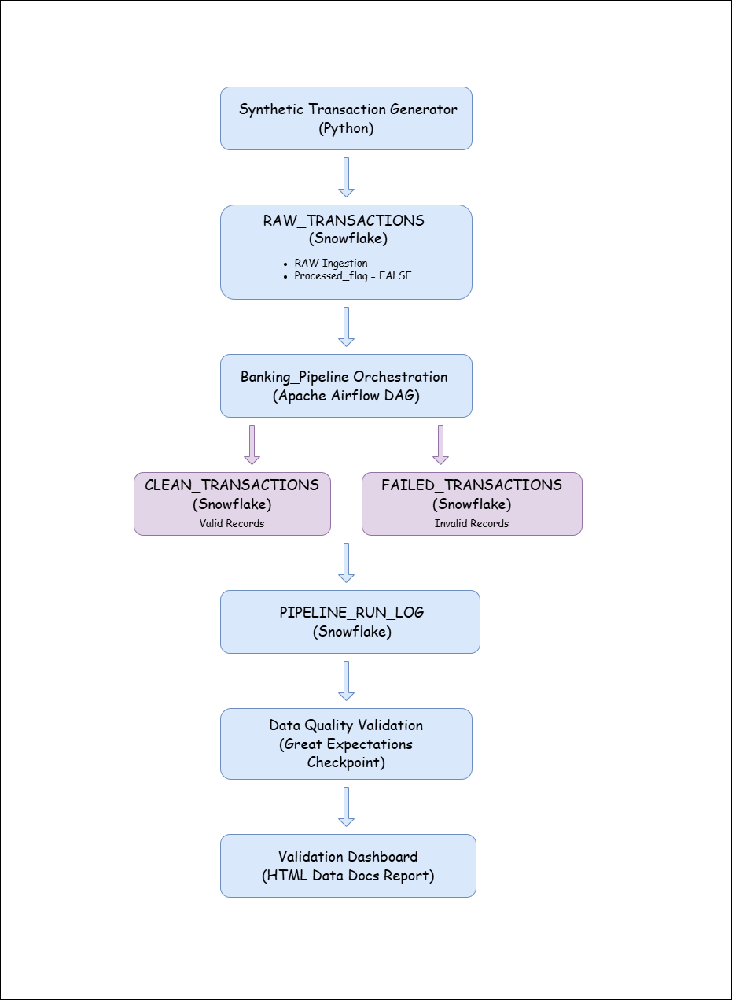
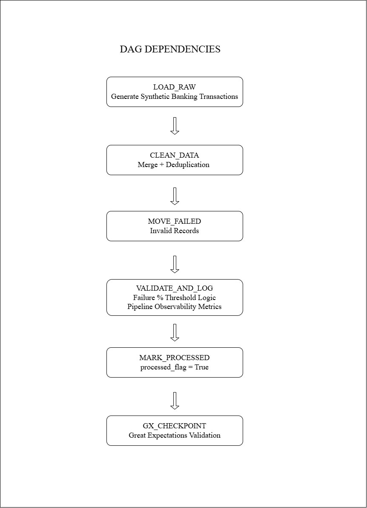

# Banking Data Pipeline (End-to-End Data Engineering Project)

## Project Overview

This project simulates an end-to-end banking transaction data pipeline built using modern data engineering tools.

The pipeline generates synthetic banking transactions, ingests them into Snowflake, performs data validation and transformation, and orchestrates the workflow using Apache Airflow.

Data quality checks are implemented using both SQL validation logic and Great Expectations.

The project demonstrates how a production-style ETL pipeline can be designed with data validation, observability, and workflow orchestration.

---

## Architecture

The pipeline architecture consists of the following components:

1. Synthetic Data Generation
2. Snowflake Data Warehouse
3. Data Validation Layer
4. Workflow Orchestration (Airflow)
5. Data Quality Framework (Great Expectations)
6. Pipeline Monitoring and Logging

Architecture Diagram:

---

## DAG Workflow

The pipeline workflow is orchestrated using Apache Airflow.

Pipeline Flow:

Main DAG Tasks:

1. **load_raw**
   - Generates synthetic banking transaction data
   - Inserts records into RAW_TRANSACTIONS table

2. **clean_data**
   - Removes duplicates using ROW_NUMBER
   - Filters valid transactions
   - Loads clean data into CLEAN_TRANSACTIONS table

3. **move_failed**
   - Moves invalid records to FAILED_TRANSACTIONS table

4. **validate_and_log**
   - Calculates validation metrics
   - Logs pipeline execution statistics
   - Determines pipeline health status

5. **gx_checkpoint**
   - Executes Great Expectations validation
   - Logs validation results

6. **mark_processed**
   - Marks processed records in RAW table

---

## Data Validation

Data quality checks are implemented at two levels:

### SQL Validation

Rules applied:

- Transaction ID must not be NULL
- Amount must be greater than 0
- Transaction type must be DEBIT or CREDIT
- Transaction timestamp cannot be in the future

Invalid records are moved to the FAILED_TRANSACTIONS table.

---

### Great Expectations Validation

Great Expectations is used to perform additional data validation checks on the CLEAN_TRANSACTIONS table.

It provides:

- Expectation suites
- Data validation reports
- Data quality monitoring

Validation is executed through a GX checkpoint.

---

## Pipeline Monitoring

Pipeline execution metrics are stored in the table:

PIPELINE_RUN_LOG

Metrics captured:

- Total records processed
- Passed records
- Failed records
- Validation status
- Error category
- Execution time
- Great Expectations validation status

Email alerts are configured for pipeline failures.

---

## Technologies Used

- Python
- Apache Airflow
- Snowflake
- Great Expectations
- SQL
- Linux

---

## Project Structure

banking-data-pipeline/

├── dags/
│   └── banking_pipeline_dag.py
│
├── gx/
│   ├── great_expectations.yml
│   ├── expectations/
│   ├── checkpoints/
│
├── diagrams/
│   ├── architecture_diagram.png
│   └── DAG_flow_diagram.png
│
├── add_expectations.py
│
└── README.md

---

## Key Features

- End-to-End Data Pipeline
- Airflow DAG Orchestration
- Data Validation Layer
- Great Expectations Integration
- Failure Threshold Monitoring
- Pipeline Execution Logging
- Automated Data Quality Checks
